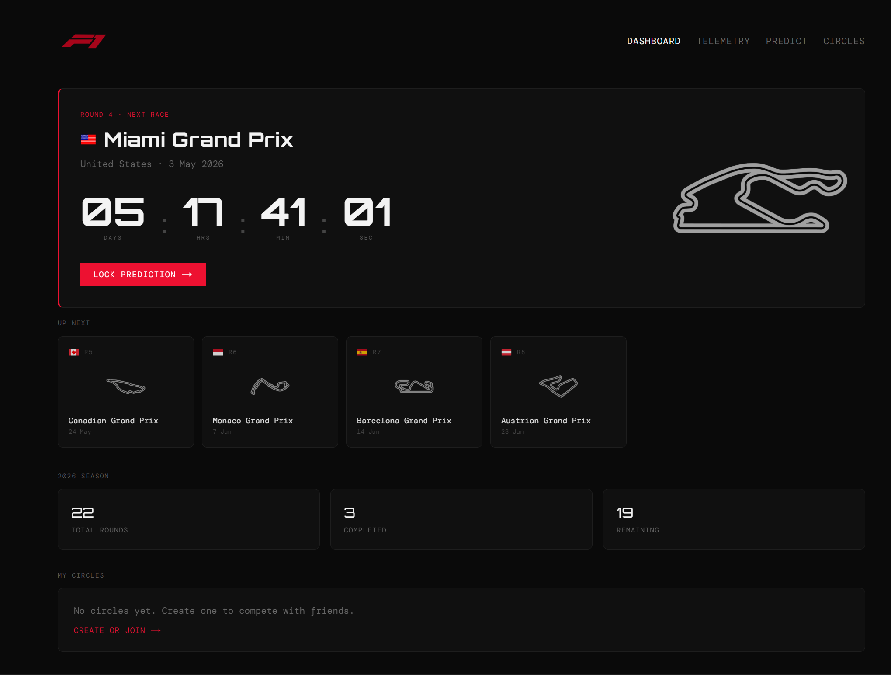
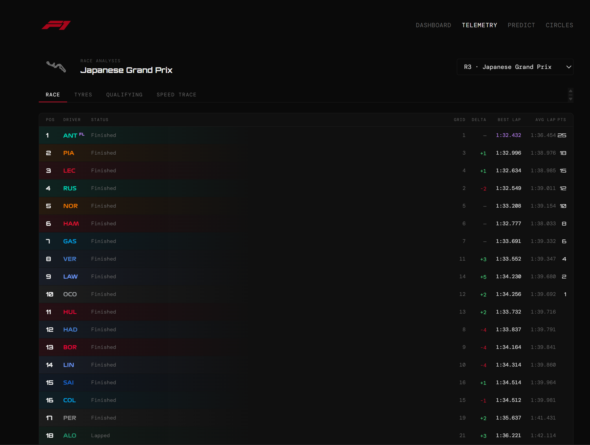
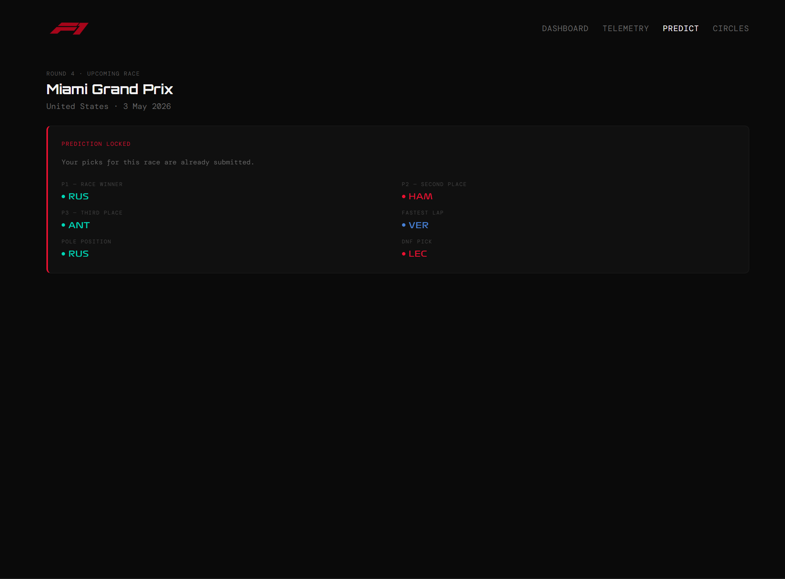

<div align="center">

# DreamF1 🏎️

**Compete with friends on F1 race outcomes. Pick your podium, pole, fastest lap, and DNF before each race — earn points when results come in.**


</div>

## UI





## How it works

1. **Register** — create an account, join or create a Circle (friend group).
2. **Dashboard** — live countdown to the next race, season progress, upcoming rounds strip.
3. **Submit your race card** — lock in six picks before race start. Duplicate driver prevention built in.
4. **Telemetry** — race classification, tyre strategies, qualifying times, and speed traces for any past round.
5. **Auto-scoring** — FastF1 fetches official results post-race and calculates points.
6. **Leaderboard** — per-Circle standings update after each Grand Prix.

```text
  [ User ]           [ FastAPI ]              [ FastF1 ]
     │                    │                       │
     │  submit race card  │                       │
     ├───────────────────>│  validate + persist   │
     │                    │                       │
     │                    │  fetch race results ──>
     │                    │<──────────────────────
     │  leaderboard update│  score + rank         │
     │<───────────────────│                       │
```

## Features

- **Six pick categories** — P1, P2, P3, Pole Position, Fastest Lap, and optional DNF per race.
- **Duplicate prevention** — driver dropdowns disable already-selected drivers across sibling slots.
- **Live countdown** — real-time timer to the next Grand Prix with upcoming rounds strip.
- **Telemetry dashboard** — race classification, tyre strategy, qualifying deltas, and speed trace per round.
- **Circles** — private friend groups with invite codes and per-circle leaderboards.
- **Auto-scoring engine** — results pulled from FastF1 post-race, points computed without manual input.
- **JWT authentication** — OAuth2 password flow, bcrypt hashing, short-lived tokens.
- **Responsive** — dark glassmorphism UI works on mobile, tablet, and desktop.

## Stack

| Layer     | Tech                            |
| :-------- | :------------------------------ |
| Frontend  | Next.js 16.2, Tailwind CSS v4   |
| Backend   | FastAPI, SQLAlchemy, PostgreSQL |
| Auth      | JWT, OAuth2, bcrypt             |
| Data      | FastF1, Pandas                  |
| Prototype | Streamlit, Plotly               |
| Infra     | Docker, Docker Compose          |

## Quick start

### Docker (recommended)

```bash
git clone https://github.com/Aabhaskhandelwal/DreamF1
cd DreamF1
docker compose up --build
```

- Next.js app: http://localhost:3000
- API docs: http://localhost:8080/docs
- Streamlit: http://localhost:8501

### Local

```bash
# backend
cd backend && uv sync
uvicorn main:app --port 8080 --reload

# Next.js frontend
cd frontend && npm install && npm run dev

# Streamlit prototype (optional)
cd frontend-prototype && uv sync
streamlit run main.py
```

### Environment variables

Create a `.env` file in `/backend`:

```env
# database
POSTGRES_USER=your_user
POSTGRES_PASSWORD=your_password
POSTGRES_HOST=localhost
POSTGRES_PORT=5433
POSTGRES_DB=f1db

# auth
SECRET_KEY=your_secret_key
ALGORITHM=HS256
```

## Ongoing

- [x] Next.js production frontend — dark glassmorphism UI, fully responsive
- [ ] My Predictions page — full history with per-race point breakdowns
- [ ] ML prediction model — historical F1 data → podium probabilities, DNF risk per driver and circuit

## Contributing

1. Fork the repo and clone it
2. Create a branch: `git checkout -b feature/your-feature`
3. Make your changes and commit: `git commit -m "feat: describe what this does"`
4. Open a PR — describe what you changed and why

For bugs, open an issue first. For bigger ideas, start a discussion.
