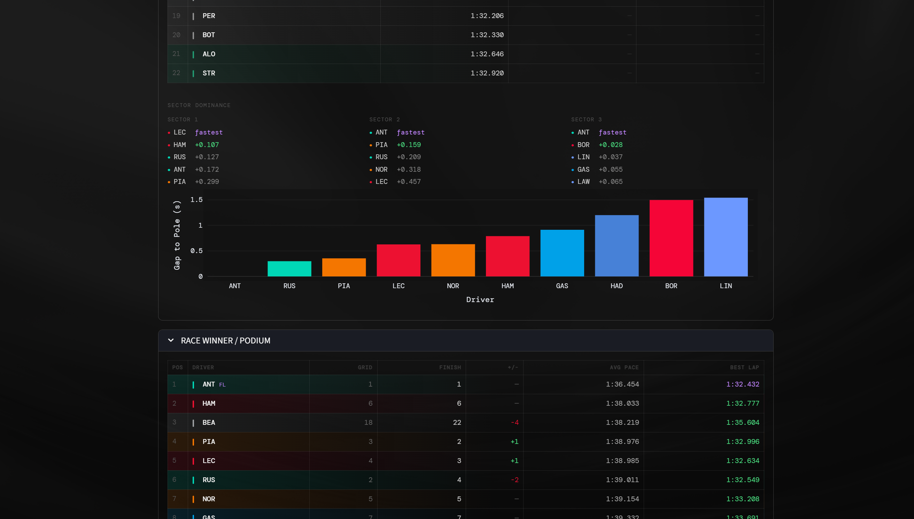
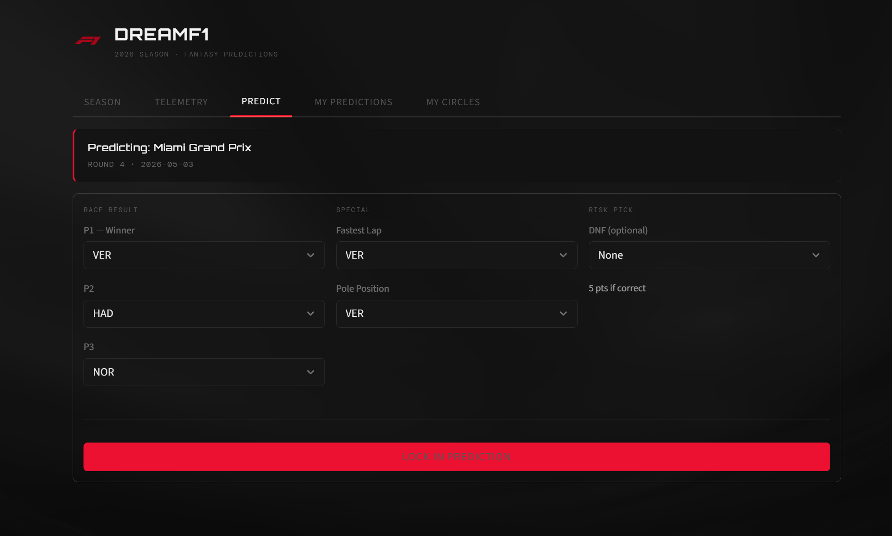

# DreamF1 🏎️
Compete with friends on F1 race outcomes. Pick your podium, pole, fastest lap, and DNF before each race — earn points when results come in. Track on a friends group leaderboard.

## What it does
- Register and authenticate via JWT
- View the 2026 F1 race calendar
- Pick across 6 categories (P1, P2, P3, Pole, Fastest Lap, DNF)
- Auto-scores using real race data from FastF1
- Telemetry dashboard — qualifying times, tyre strategy, pace rankings

## UI




## Stack

| Layer | Tech |
|-------|------|
| Backend | FastAPI, SQLModel, PostgreSQL |
| Auth | JWT, OAuth2, bcrypt |
| Data | FastF1, Pandas |
| Frontend | Streamlit, Plotly |
| DevOps | Docker |

## Getting started

**Docker**
```bash
git clone https://github.com/Aabhaskhandelwal/DreamF1
cd DreamF1
docker compose up --build
```
- Frontend: http://localhost:8501
- API docs: http://localhost:8080/docs

**Local**
```bash
# backend
cd backend && uv sync
uvicorn main:app --port 8080

# frontend
cd ../frontend-prototype && uv sync
streamlit run main.py
```

`.env` in `/backend`:
```
POSTGRES_USER=your_user
POSTGRES_PASSWORD=your_password
POSTGRES_HOST=localhost
POSTGRES_PORT=5433
POSTGRES_DB=f1db
SECRET_KEY=your_secret_key
ALGORITHM=HS256
```

## Contributing
1. Fork the repo and clone it
2. Create a branch: `git checkout -b feature/your-feature`
3. Make your changes and commit
4. Open a PR — describe what you changed and why

For bugs, open an issue first. For questions, start a discussion.

## Ongoing
- Next.js production frontend
- Chatbot in sidebar to help users learn about formula 1, and help predict next race
- ML model trained on historical F1 data to predict podium chances, fastest laps, and DNF risk per driver and circuit, with accuracy and confidence scores for each prediction.