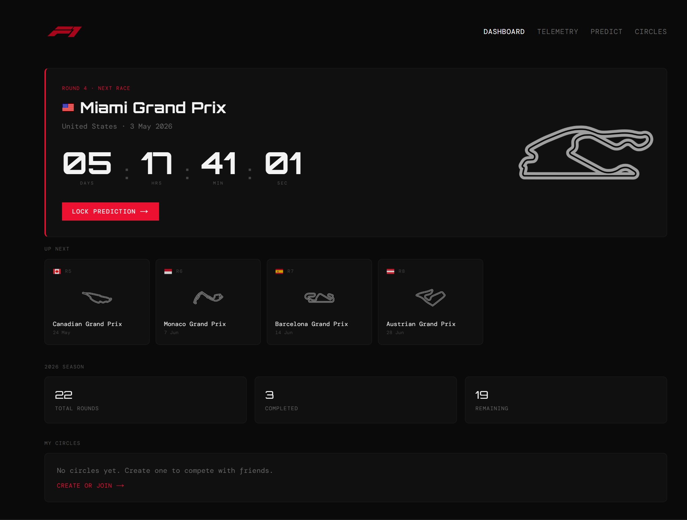
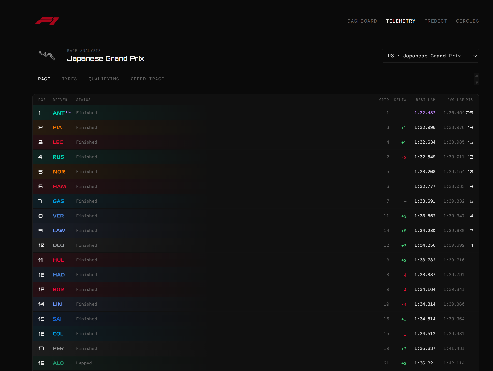
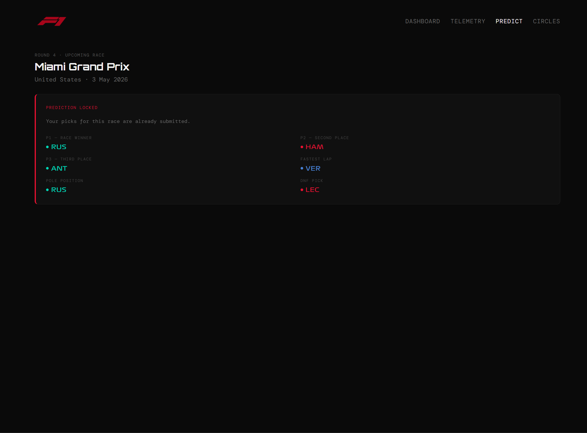

<div align="center">

<p align="center">
  
</p>

**Compete with friends on F1 race outcomes. Predict the podium, pole, fastest lap, DNF and more before each Grand Prix — earn points when the real results come in.**

[**▶ Live app — dream-f1.vercel.app**](https://dream-f1.vercel.app)


</div>

## UI

<p align="center">
  
  
  
</p>

All data is real 2026 Formula 1 data, pulled live from [FastF1](https://docs.fastf1.dev/). The UI is a dark, technical, glassmorphism design built to feel like a broadcast pit-wall.

## How it works

1. **Register** — create an account, then create or join a **Circle** (private friend group) with an invite code.
2. **Dashboard** — live countdown to the next session, championship standings, the last-race recap, and the upcoming-rounds strip.
3. **Submit your race card** — lock in your picks before the race starts; the form is auto-locked to the next race and prevents picking the same driver twice.
4. **Explore** — dig into per-round telemetry, full championship standings, and head-to-head driver comparisons.
5. **Auto-scoring** — after the race, FastF1 fetches the official results and points are computed automatically.
6. **Leaderboard** — each Circle's standings update after every Grand Prix.

```text
  [ User ]           [ FastAPI ]              [ FastF1 ]
     │                    │                       │
     │  submit race card  │                       │
     ├───────────────────>│  validate + persist   │
     │                    │                       │
     │                    │  fetch race results ──>
     │                    │<──────────────────────
     │  leaderboard update│  score + rank         │
     │<───────────────────│                       │
```

## Features

### Predictions & Circles
- **Up to 9 pick categories** per race — Pole, P1, P2, P3 and Fastest Lap (required), plus optional P4, P5, DNF and a Safety Car yes/no call.
- **Strictly next race** — the predict form is always locked to the next unscored Grand Prix; no race picker, no editing the past.
- **Duplicate prevention** — driver dropdowns disable already-selected drivers across position slots.
- **Auto-scoring engine** — results pulled from FastF1 post-race, points computed without manual input (max **64 pts/race**).
- **Circles** — private friend groups with invite codes and per-circle leaderboards.
- **My Picks** — full prediction history with points, accuracy, and per-race status.

### Telemetry explorer (12 views per round)
Race classification · Lap times · Race pace · Position changes · Gaps to leader · Tyre strategy · Qualifying (Q1/Q2/Q3 knockout) · Sector times · Speed traces · **Circuit explorer** (detailed track diagrams + length/laps/record stats) · **Weather** (track/air temp, humidity, wind, rainfall over the race) · **Race Control** (flags, safety cars, VSC, penalties, investigations — filterable feed).

### Championship & comparison
- **Standings** — full Drivers' and Constructors' championship tables with wins, podiums, poles, DNFs, form and gaps; a top-3 Constructors' podium showcase.
- **Compare** — head-to-head driver telemetry comparison for any past round.

### Platform
- **JWT authentication** — bcrypt-hashed passwords, validated sign-up with auto-login.
- **Responsive** — dark glassmorphism UI works on mobile, tablet, and desktop.

## Scoring

| Category      | Points | Notes                              |
| :------------ | :----: | :--------------------------------- |
| P1 / P2 / P3  |   10   | Required                           |
| Pole Position |    5   | Required                           |
| Fastest Lap   |    5   | Required                           |
| P4            |    8   | Optional                           |
| P5            |    6   | Optional                           |
| DNF           |    5   | Optional — any driver who retires  |
| Safety Car    |    5   | Optional — was there a SC? yes/no  |
| **Max/race**  | **64** |                                    |

## Stack

| Layer      | Tech                                         |
| :--------- | :------------------------------------------- |
| Frontend   | Next.js 16 (App Router), Tailwind CSS v4     |
| Charts     | Hand-built SVG (telemetry, weather, circuit) |
| Backend    | FastAPI, SQLModel / SQLAlchemy, PostgreSQL   |
| Auth       | JWT bearer, bcrypt                           |
| Data       | FastF1, Pandas, NumPy                        |
| Prototype  | Streamlit, Plotly (reference build)          |
| Infra      | Docker, AWS EC2 + ECR, Vercel                |
| CI/CD      | GitHub Actions (test, build, deploy)         |

## Quick start

### Docker (recommended)

```bash
git clone https://github.com/Aabhaskhandelwal/DreamF1
cd DreamF1
docker compose up --build
```

- Next.js app: http://localhost:3000
- API docs: http://localhost:8080/docs
- Streamlit prototype: http://localhost:8501

### Local

```bash
# backend
cd backend && uv sync
uvicorn main:app --port 8080 --reload

# Next.js frontend
cd frontend && npm install && npm run dev

# Streamlit prototype (optional)
cd frontend-prototype && uv sync
streamlit run main.py
```

### Environment variables

Create a `.env` file in `/backend`:

```env
# database
POSTGRES_USER=your_user
POSTGRES_PASSWORD=your_password
POSTGRES_HOST=localhost
POSTGRES_PORT=5432
POSTGRES_DB=f1db

# auth
SECRET_KEY=your_secret_key
ALGORITHM=HS256
```

## Deployment

- **Frontend** → **Vercel**, auto-deployed on every push to `main`. Browser calls hit a relative `/api/*` path that `vercel.json` rewrites to the backend (avoids HTTPS→HTTP mixed-content).
- **Backend** → **AWS EC2**, via **GitHub Actions**: build the image, push to **ECR**, then SSH in and `docker compose up` (Postgres + FastAPI). FastF1's cache is a persistent Docker volume.

## Roadmap

- [x] Production Next.js frontend (Vercel) + FastAPI backend (AWS EC2)
- [x] Full telemetry explorer — 12 views per round, incl. circuit / weather / race control
- [x] Drivers' & Constructors' championship standings
- [x] My Picks history and head-to-head driver comparison
- [ ] ML pick advisor — historical data → podium probabilities & DNF risk per driver/circuit
- [ ] Elastic IP + HTTPS (reverse proxy) on the backend

## Contributing

Contributions are welcome — see [CONTRIBUTING.md](CONTRIBUTING.md) for setup, the golden rules of the prediction logic, and [good first issues](https://github.com/Aabhaskhandelwal/DreamF1/issues?q=is%3Aissue+is%3Aopen+label%3A%22good+first+issue%22) to start with.
